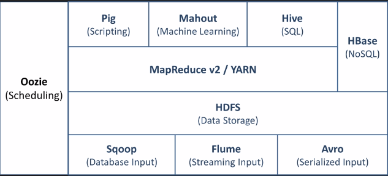
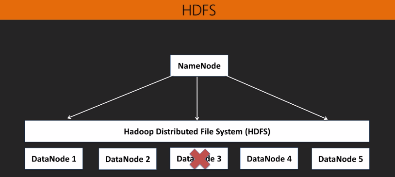
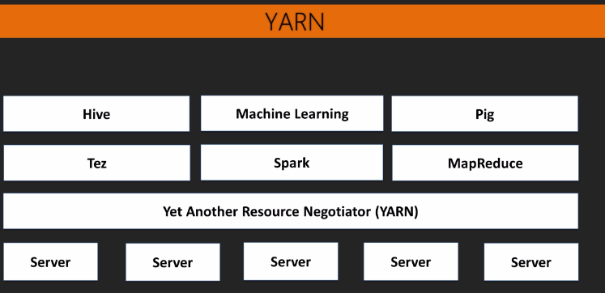
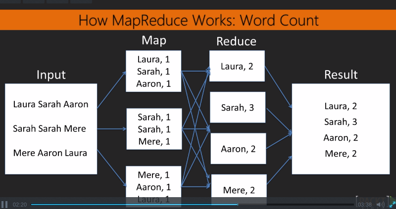

# Learning Hadoop 2 Note

## Section 1 Overview of Haddop Ecosystem

## Section 1.1 Overview of HDFS and YARN

**DIstributed computing**

* Probllem: Big Data strains computing resources (CPU, storage)
* Solution: Distribute the load over many servers rather than one
* Yahoo! used the distributed computing model to develop Hadoop

**Hadoop Distributed File System(HDFS)**

* File system for Hadoop
* Spans all nodes in a cluster
* Stores data in 64M chuncks on multiple servers

**Yet Another Resouce Negotiator(YARN)**

* Control access to cluster resources
* New in Hadoop 2
* Allows multiple compute engines to run (MapReduce, Spark, Tez, and so on)

## Section 1.2 Overview of Sqoop and Flume

**How we get data into the HDFS**

**Sqoop(SQl on hadOOP)**

* Pulls data from relational databases (Oracle, PostgreSQL, and so on)
* Stores on HDFS or import directly to Hive
* Uses drivers that are not included

**Flume**

* Used to import streaming data(server log, tweets, and so on)
* Only a transport agent
* Buffered
* Three parts: Source, Channel, and Sink

##Section 1.3 Overview of MapReduce

* Created by Yahoo! from a paper by Google
* Computation engine
* Coded in Java
* Two important functions: Map and Reduce

**How it works:**

**How create a MapReduce Program:**

* Create Java code
	* Import packages
	* Map: "Tokenize" words, create key/value pairs
	* Reduce: Sum instances fo each word from all lines, create new key/value
	* Results in about 65 lines of code
* Compile and create a .jar from Java code
* Add .jar to Hadoop repository to use

##Section 1.4 Overview of Pig
* Developed by Yahoo! shortly after MapReduce
* Dataflow scripting language
* Builds MapReduce programs from scripts and translate into Java
* User Definable Functions(UDFs)

##Section 1.5 Overview of Hive
* Data warehousing solution for Hadoop
* Uses tables, just like traditional databases
* HiveQL - SQL-ish query language
* Schema on load
	* on traditional DB you have to define your schema before you load any data; Hive allows you define your schema after loading data
* Uses MapReduce as the engine

**Hive and Metadata**

* Metadata - data that describes data
* Derby 
* Derby versus MySQL

**Internal Versus External Tables**

* Internal Table(default)
	* Stores data in `user/hive/warehouse`
	* Not accessible to other applications
	* Dropping table delete data and metadata
	
* External Table
	* Data stays on HDFS
	* Accessible to other applications
	* Dropping table deletes only the metadata
	

**HiveQL versus SQL**

|HiveQL|SQL|
|---------|---------|
|CREATE DATABASE name;|CREATE DATABASE name;|
|SELECT * FROM table;|SELECT * FROM table;|
|SELECT COUNT(*) FROM table;|SELECT COUNT(*) FROM table;|
|Default Join is 'equi'|Default Join is 'inner'|
|Left Outer Join|Left Join|

## Summary

* HDFS and YARN - file system and resource scheduler
* Sqoop and Flume - automated data import/export
* MapReduce - original computional engine of Hadoop
* Pig- scripting language
* Hive - data warehousing

