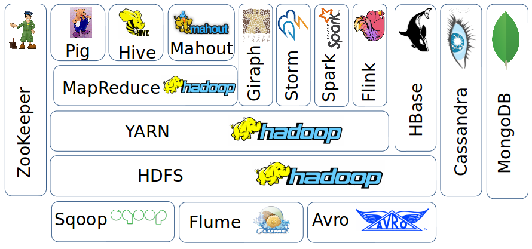
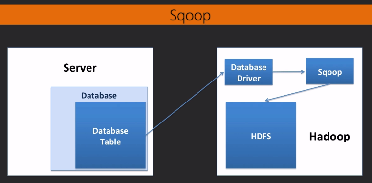
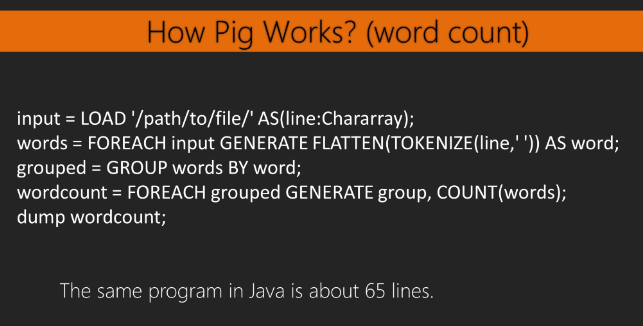

# Learning Note on Hadoop 2 

A combined note from on-line courses:

* **Big Data - Unlock Value in Massive Datasets** from University of California, San Diego [Coursera Specification](https://www.coursera.org/specializations/big-data)
* **Learning Hadoop 2** by Randal Scott King [Video Class from Packtpub](https://www.packtpub.com/mapt/video/big_data_and_business_intelligence/9781785888113)

## Section 1 Overview of Hadoop Ecosystem

### Section 1.1 Overview of HDFS and YARN

**Distributed computing**

* Problem: Big Data strains computing resources (CPU, storage)
* Solution: Distribute the load over many servers rather than one
* Yahoo! used the distributed computing model to develop Hadoop

**Hadoop Distributed File System(HDFS)**

* File system for Hadoop
* Spans all nodes in a cluster
* Stores data in 64M chunks on multiple servers

**Yet Another Resource Negotiator(YARN)**

* Control access to cluster resources
* New in Hadoop 2
* Allows multiple compute engines to run (MapReduce, Spark, Tez, and so on)

### Section 1.2 Overview of Sqoop and Flume

**How we get data into the HDFS**

**Sqoop(SQl on hadOOP)**

* Pulls data from relational databases (Oracle, PostgreSQL, and so on)
* Stores on HDFS or import directly to Hive
* Uses drivers that are not included

**Flume**

* Used to import streaming data(server log, tweets, and so on)
* Only a transport agent
* Buffered
* Three parts: Source, Channel, and Sink

### Section 1.3 Overview of MapReduce

* Created by Yahoo! from a paper by Google
* Computation engine
* Coded in Java
* Two important functions: Map and Reduce

**How it works:**

**How create a MapReduce Program:**

* Create Java code
	* Import packages
	* Map: "Tokenize" words, create key/value pairs
	* Reduce: Sum instances fo each word from all lines, create new key/value
	* Results in about 65 lines of code
* Compile and create a .jar from Java code
* Add .jar to Hadoop repository to use

### Section 1.4 Overview of Pig
* Developed by Yahoo! shortly after MapReduce
* Dataflow scripting language
* Builds MapReduce programs from scripts and translate into Java
* User Definable Functions(UDFs)

### Section 1.5 Overview of Hive
* Data warehousing solution for Hadoop
* Uses tables, just like traditional databases
* HiveQL - SQL-ish query language
* Schema on load
	* on traditional DB you have to define your schema before you load any data; Hive allows you define your schema after loading data
* Uses MapReduce as the engine

**Hive and Metadata**

* Metadata - data that describes data
* Derby 
* Derby versus MySQL

**Internal Versus External Tables**

* Internal Table(default)
	* Stores data in `user/hive/warehouse`
	* Not accessible to other applications
	* Dropping table delete data and metadata
	
* External Table
	* Data stays on HDFS
	* Accessible to other applications
	* Dropping table deletes only the metadata
	

**HiveQL versus SQL**

|HiveQL|SQL|
|---------|---------|
|CREATE DATABASE name;|CREATE DATABASE name;|
|SELECT * FROM table;|SELECT * FROM table;|
|SELECT COUNT(*) FROM table;|SELECT COUNT(*) FROM table;|
|Default Join is 'equi'|Default Join is 'inner'|
|Left Outer Join|Left Join|

### Summary

* HDFS and YARN - file system and resource scheduler
* Sqoop and Flume - automated data import/export
* MapReduce - original computational engine of Hadoop
* Pig- scripting language
* Hive - data warehousing

## Section 2 Installing and Configuring Hadoop

### Downloading and Installing Cloudera Quickstart VM

Use following instructions to download and install the Clourdera Quickstart VM with VirtualBox. The screenshots are taken from Windows, but the instructions should be the same for Mac computer.

1. **Install VirtualBox.** If you don't have VirtualBox installed yet, you can go to [https://www.virtualbox.org/wiki/Downloads](https://www.virtualbox.org/wiki/Downloads) to download and install the latest version of VirtualBox for your computer.
2. **Download Cloudera Quickstart VM.** Go to [http://www.cloudera.com/downloads/quickstart_vms/5-8.html](http://www.cloudera.com/downloads/quickstart_vms/5-8.html) and specify VirtualBox as platform to download the latest version of Cloudera Quickstart VM. It might take some time to download, since the VM is over 4GB. After download, unzip the VM.
3. **Import Cloudera VM to VirtualBox**. Start VirtualBox, import VM by going to File --> Import Appliance, select the .ovf file from the folder where you unzipped the Cloudera VM and click Open. Follow the instructions prompted by the VirtualBox to finish importing process.
5. **Configure and Launch Cloudera VM**. When the importing is finished, the Cloudera Quickstart VM will appear on the left in the VirtualBox window. Select it and go to settings and pick General, make sure the OS type is Linux in the Basic tab and both Shared Clipboard and Drag and Drop are Bidirectional. Set enough memory in the System list. After all settings, click the Start button to launch the VM.

### Overview of Hue GUI

# Learning HBase

## Understanding the HBase Ecosystem

